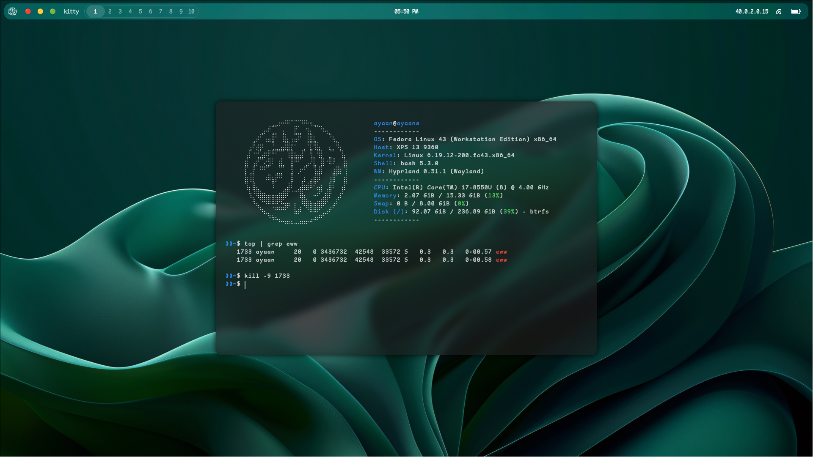
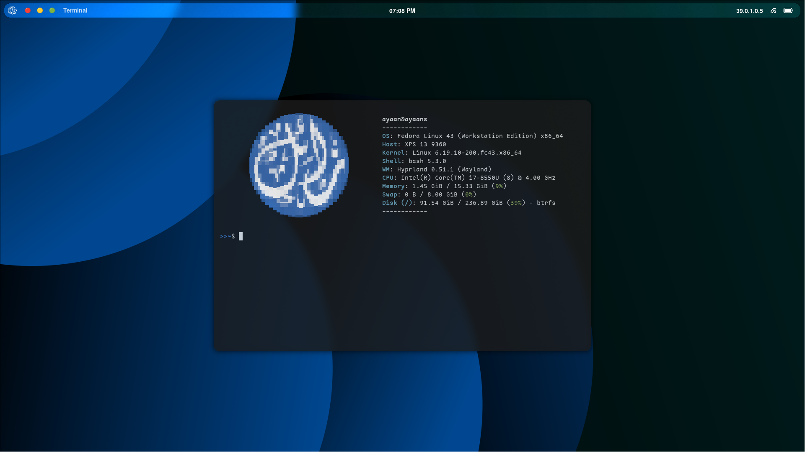
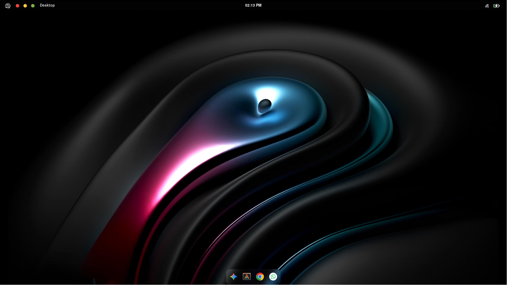
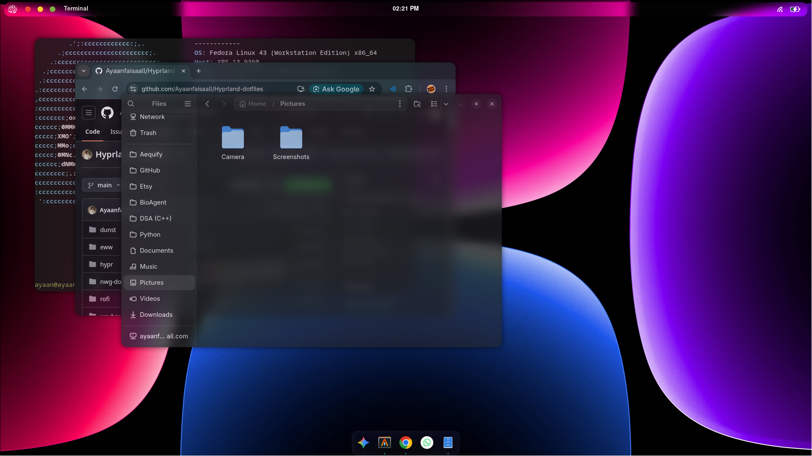
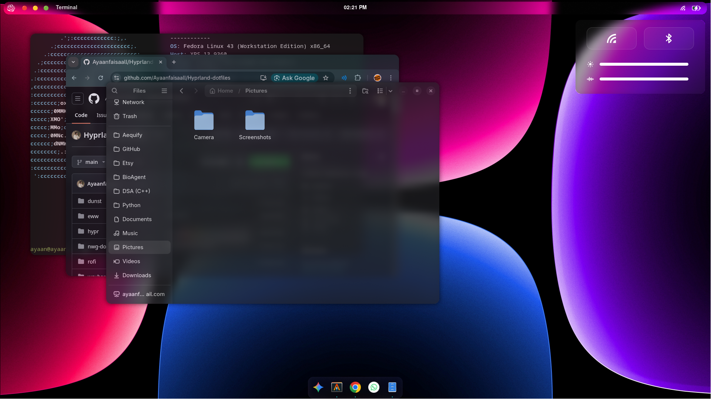
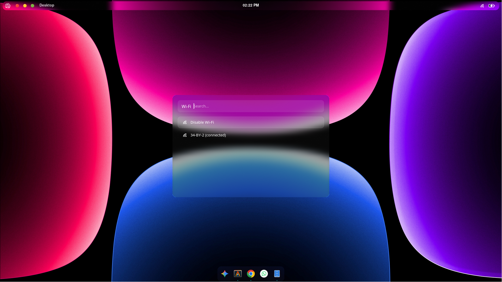

# Frosted Glass Hyprland Dots

A minimalist, modern, and "frosted glass" inspired dotfiles configuration for Hyprland, tailored for Fedora Linux. 

This repository contains the configuration files required to replicate a clean, dark-themed desktop environment with square borders, unified blur effects, and a highly modular architecture.

---

## Screenshots








---

## Why This Setup Exists

Finding a balance between a feature-rich desktop and a visually calm workspace can be difficult. This configuration addresses that by:
* Enforcing a strict minimalist, dark, and frosted glass aesthetic across all UI elements.
* Keeping the Hyprland configuration highly modular for easy debugging and scaling.
* Utilizing lightweight tools like `eww` and `rofi` to create custom, beautiful control centers and launchers without bloating the system.

---

## Key Features

* **Window Manager:** Hyprland with square borders and optimized blur/transparency rules.
* **Bar:** Waybar customized with a minimal footprint and custom SVG icons.
* **Launcher:** Rofi styled to match the semi-transparent, frosted glass theme.
* **Control Center:** Eww (Elkowar's Wacky Widgets) for quick access to Wi-Fi, Bluetooth, brightness, and volume controls.
* **Dock:** `nwg-dock-hyprland` for a subtle, macOS-like bottom dock.
* **Notifications:** Dunst configured to blend seamlessly with the dark aesthetic.

---

## Project Structure

```text
Hyprland-dotfiles/
│
├── .config/
│   ├── alacritty/
│   │   └── alacritty.toml
│   ├── dunst/
│   │   └── dunstrc
│   ├── fastfetch/
│   │   ├── logo/
│   │   └── config.jsonc
│   ├── eww/
│   │   ├── assets/
│   │   ├── scripts/
│   │   ├── eww.scss
│   │   └── eww.yuck
│   ├── foot/
│   │   └── foot.ini
│   ├── hypr/
│   │   ├── scripts/
│   │   ├── wallpapers/
│   │   ├── autostart.conf
│   │   ├── bindings.conf
│   │   ├── env.conf
│   │   ├── hyprland.conf
│   │   ├── hyprpaper.conf
│   │   ├── hyprlock.conf
│   │   ├── input.conf
│   │   ├── lookandfeel.conf
│   │   ├── monitor.conf
│   │   ├── permissions.conf
│   │   ├── programs.conf
│   │   ├── window.conf
│   │   └── winrulev2.conf
│   ├── keyd/
│   │   └── default.conf
│   ├── kitty/
│   │   └── kitty.conf
│   ├── nwg-dock-hyprland/
│   │   └── style.css
│   ├── plymouth/
│   │   └── themes/
│   ├── rofi/
│   │   └── config.rasi
│   └── waybar/
│       ├── icons/
│       ├── logo/
│       ├── config.jsonc
│       └── style.css
│
├── .rc/
├── screenshots/
├── scripts/
│   └── theme.sh
├── dependencies.txt
├── install.sh
├── LICENSE
└── README.md
```

---

## Component Overview
* **hypr**: The core window manager configuration. It is split into logical modules (autostart.conf, bindings.conf, lookandfeel.conf, etc.) to keep the main hyprland.conf clean. Custom bash scripts handle specialized window behaviors like floating toggles and window minimization.
* **eww**: Powers the custom control center widget. Contains .yuck layout files, .scss styling, and shell scripts to fetch and toggle system states (Wi-Fi, Bluetooth, Audio).
* **waybar**: The main status bar at the top of the screen. It relies heavily on a custom directory of .svg icons to maintain a minimal, text-light appearance.
* **rofi**: The application launcher. Configured with a config.rasi file to ensure the background blur and dark theme perfectly match the terminal and Eww widgets.
* **nwg-dock-hyprland**: A simple application dock positioned at the bottom of the screen, styled via CSS to match the border and transparency rules of the overall system.

---

## Installation
Use the install.sh script:

```Bash
git clone https://github.com/Ayaanfaisaall/Hyprland-dotfiles.git
cd Hyprland-dotfiles
chmod +x install.sh
./install.sh
```

---

## Keybindings

This configuration uses the **`SUPER`** (Windows/Meta) key as the main modifier (`$mainMod`). 

### System Commands
| Shortcut | Action |
| :--- | :--- |
| `SUPER` + `ALT` + `E` | Exit Hyprland (with confirmation) |
| `SUPER` + `ALT` + `P` | Poweroff (with confirmation) |
| `SUPER` + `ALT` + `R` | Reboot (with confirmation) |
| `SUPER` + `ALT` + `L` | Lock (with confirmation) |
| `SUPER` + `ALT` + `S` | Suspend (with confirmation) |

### Window Management
| Shortcut | Action |
| :--- | :--- |
| `SUPER` + `Q` | Kill active window |
| `SUPER` + `F` | Toggle fullscreen |
| `SUPER` + `ALT` + `F` | Toggle floating mode |
| `SUPER` + `J` | Toggle split |
| `SUPER` + `P` | Pseudo tiling |
| `SUPER` + `O` | Toggle window opacity |
| `SUPER` + `M` | Minimize window |
| `SUPER` + `ALT` + `M` | Recover minimized window (works as stack) |
| `ALT` + `H/J/K/L` | Move focus (Left / Down / Up / Right) |
| `SUPER` + `Left Click` | Move window (drag) |
| `SUPER` + `Right Click` | Resize window (drag) |

### Applications & Utilities
| Shortcut | Action |
| :--- | :--- |
| `SUPER` + `T` | Open Terminal |
| `SUPER` + `C` | Open Google Chrome |
| `SUPER` + `R` | Open Rofi (App Launcher) |
| `Print Screen` | Take a screenshot |
| `SUPER` + `V` | Open clipboard manager |
| `SUPER` + `ALT` + `V` | Clear clipboard history |

### UI & Menus
| Shortcut | Action |
| :--- | :--- |
| `SUPER` + `E` | Open Control Center |
| `SUPER` + `D` | Show Dock |
| `SUPER` + `B` | Bluetooth menu |
| `SUPER` + `W` | Wi-Fi menu |

### Audio & Brightness
*Standard keyboard media/function keys are mapped to custom OSD notifications.*

| Shortcut | Action |
| :--- | :--- |
| `Volume Up / Down` | Adjust system volume |
| `Mute` | Toggle audio mute |
| `Mic Mute` | Toggle microphone mute |
| `Brightness Up / Down` | Adjust screen brightness |

---

## Custom Scripts

To keep the configuration clean and modular, complex window management and custom UI menus are handled by dedicated bash scripts.

### Hyprland Scripts (`Hyprland-dotfiles/.config/hypr/scripts`)
| Script | Functionality |
| :--- | :--- |
| `confirm.sh` | Launches a Rofi menu to confirm critical system actions (poweroff, reboot, exit) to prevent accidental triggers. |
| `floating.sh` | Transitions the active window to floating mode, automatically centering it on the screen with a perfectly proportioned size. |
| `minimize.sh` | Handles the custom logic for minimizing and restoring active windows in the workspace. |
| `osd.sh` | Powers the custom On-Screen Display (OSD), providing visual popups for hardware controls like volume, mic, and brightness adjustments. |
| `toggleopaque.sh` | Toggles the active window's opacity. Perfect for quickly switching between a solid background and that clean, frosted glass aesthetic. |

### Connectivity Menus (`Hyprland-dotfiles/.config/eww/scripts`)
| Script | Functionality |
| :--- | :--- |
| `bluetooth.sh` | Spawns a custom Rofi interface to scan for, list, and seamlessly connect to available Bluetooth devices. |
| `wifi.sh` | Opens a custom Rofi menu to display available Wi-Fi networks and manage connections without needing a heavy GUI network manager. |

### Theme Management (`Hyprland-dotfiles/scripts`)
| Script | Functionality |
| :--- | :--- |
| `theme.sh` | Dynamically updates the Hyprland and SDDM wallpapers based on a numerical argument, and seamlessly toggles the custom Waybar logo to match the theme while reloading the necessary services. |

---

## Credits

- Hyprland developers
- eww by elkowar
- waybar community

---

## License
MIT License.
